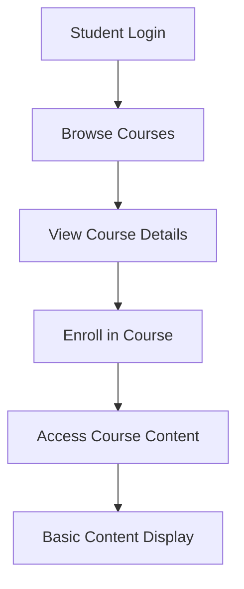
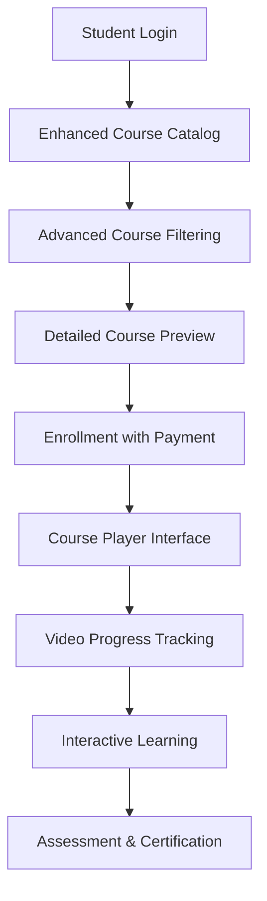

# LMS Implementation Workflow: Current Version vs Enhanced Version
**Date:** October 8, 2025  
**Project:** Full Stack Development Course Implementation  
**Status:** 📋 Implementation Guide

---

## 🔄 Current vs Enhanced Workflow Comparison

### **📊 Current System Workflow (As of October 2025)**

#### **👨‍🏫 Teacher Workflow - CURRENT**
```mermaid
graph TD
    A[Teacher Login] --> B[Access Teacher Dashboard]
    B --> C[Click "Create Course"]
    C --> D[Fill Basic Form]
    D --> E[Submit Course]
    E --> F[Wait for Admin Approval]
    F --> G[Course Published]
```

**Current Form Fields:**
```tsx
// Current Course Form (Limited)
{
  title: "Advanced React Development",
  description: "Learn advanced React concepts...",
  thumbnail: "https://example.com/image.jpg",
  price: "99"
}
```

**Current Teacher Steps:**
1. Login to `/teacher` dashboard
2. Navigate to "My Courses" section
3. Click "Create New Course" button
4. Fill out basic form (4 fields only)
5. Submit and wait for approval
6. Course appears in student catalog

#### **👨‍🎓 Student Workflow - CURRENT**


**Current Student Experience:**
1. Browse courses on `/courses` page
2. Click course card to view details
3. See basic information (title, description, price)
4. Enroll in course (if free) or pay
5. Access enrolled course with limited functionality
6. No video player integration or progress tracking

---

### **🚀 Enhanced System Workflow (Proposed)**

#### **👨‍🏫 Enhanced Teacher Workflow**
```mermaid
graph TD
    A[Teacher Login] --> B[Enhanced Teacher Dashboard]
    B --> C[Click "Create Full Stack Course"]
    C --> D[Multi-Step Course Builder]
    D --> E[YouTube Playlist Integration]
    E --> F[Course Structure Setup]
    F --> G[Assessment Configuration]
    G --> H[Preview & Submit]
    H --> I[Auto-Approval for Trusted Teachers]
    I --> J[Enhanced Course Published]
```

**Enhanced Form Fields:**
```tsx
// Enhanced Course Form (Comprehensive)
{
  // Basic Information
  title: "Complete Full Stack Development Bootcamp",
  description: "Master full stack development from HTML to deployment...",
  shortDescription: "32-week comprehensive bootcamp",
  thumbnail: "https://example.com/thumbnail.jpg",
  
  // Pricing & Access
  price: 2999,
  currency: "USD",
  paymentType: "one-time", // or "subscription"
  
  // YouTube Integration
  youtubePlaylistUrl: "https://youtube.com/playlist?list=PLrAXtmRdnEQy...",
  playlistId: "PLrAXtmRdnEQy...",
  totalVideos: 128,
  estimatedDuration: "40+ hours",
  
  // Course Metadata
  category: "Programming",
  subcategory: "Full Stack Development",
  difficulty: "Beginner to Advanced",
  tags: ["HTML", "CSS", "JavaScript", "React", "Node.js", "PostgreSQL"],
  prerequisites: ["Basic computer skills", "High school mathematics"],
  
  // Course Structure
  modules: [
    {
      id: 1,
      title: "Frontend Foundations",
      description: "HTML, CSS, JavaScript fundamentals",
      videos: ["video1", "video2", "video3"],
      duration: "8 weeks",
      assessments: ["quiz1", "project1"]
    },
    // ... more modules
  ],
  
  // Learning Outcomes
  learningOutcomes: [
    "Build responsive web applications",
    "Develop RESTful APIs with Node.js",
    "Deploy applications to production"
  ],
  
  // Instructor Information
  instructorBio: "10+ years experience in full stack development...",
  instructorCredentials: ["AWS Certified", "Google Developer Expert"],
  
  // Course Outline
  courseOutline: `
    Phase 1: Frontend Foundations (Weeks 1-8)
    Phase 2: Backend Development (Weeks 9-16)
    Phase 3: Modern Frameworks (Weeks 17-24)
    Phase 4: Full Stack Integration (Weeks 25-32)
  `,
  
  // Assessment Configuration
  hasQuizzes: true,
  hasProjects: true,
  hasCertification: true,
  passingGrade: 80
}
```

**Enhanced Teacher Steps:**
1. **Login & Dashboard Access**
   ```bash
   URL: /teacher
   Enhanced dashboard with course analytics
   ```

2. **Course Creation Wizard**
   ```tsx
   // Multi-step form with validation
   Step 1: Basic Information (title, description, category)
   Step 2: YouTube Playlist Integration (URL validation, video extraction)
   Step 3: Course Structure (modules, learning path)
   Step 4: Assessment Setup (quizzes, projects, certification)
   Step 5: Preview & Publish (course preview, final review)
   ```

3. **YouTube Integration Process**
   ```tsx
   // Automatic playlist processing
   const processPlaylist = async (playlistUrl) => {
     const playlistId = extractPlaylistId(playlistUrl);
     const videos = await fetchPlaylistVideos(playlistId);
     const totalDuration = calculateTotalDuration(videos);
     
     return {
       playlistId,
       videos,
       totalDuration,
       thumbnails: videos.map(v => v.thumbnail)
     };
   };
   ```

#### **👨‍🎓 Enhanced Student Workflow**


**Enhanced Student Experience:**
1. **Advanced Course Discovery**
   ```tsx
   // Enhanced course catalog with filtering
   - Category-based browsing
   - Difficulty level filtering
   - Duration and price filters
   - Search with tags and keywords
   - Instructor-based filtering
   ```

2. **Rich Course Preview**
   ```tsx
   // Comprehensive course information
   - Video trailer/preview
   - Complete course outline
   - Learning outcomes
   - Student testimonials
   - Instructor credentials
   - Sample lessons
   ```

3. **Integrated Learning Experience**
   ```tsx
   // YouTube player with custom controls
   const CoursePlayer = {
     playlistId: "PLrAXtmRdnEQy...",
     currentVideo: 0,
     progress: 45, // percentage
     features: [
       "Auto-progress tracking",
       "Playback speed control",
       "Subtitle support",
       "Note-taking integration",
       "Bookmark functionality"
     ]
   };
   ```

---

## 🛠️ Step-by-Step Implementation Plan

### **Phase 1: Enhanced Course Creation Form**

#### **Step 1.1: Update Database Schema**
```sql
-- Add new columns to Course table
ALTER TABLE "Course" ADD COLUMN "youtubePlaylistUrl" TEXT;
ALTER TABLE "Course" ADD COLUMN "playlistId" TEXT;
ALTER TABLE "Course" ADD COLUMN "totalVideos" INTEGER DEFAULT 0;
ALTER TABLE "Course" ADD COLUMN "estimatedDuration" TEXT;
ALTER TABLE "Course" ADD COLUMN "category" TEXT;
ALTER TABLE "Course" ADD COLUMN "subcategory" TEXT;
ALTER TABLE "Course" ADD COLUMN "difficulty" TEXT;
ALTER TABLE "Course" ADD COLUMN "tags" TEXT[];
ALTER TABLE "Course" ADD COLUMN "prerequisites" TEXT[];
ALTER TABLE "Course" ADD COLUMN "learningOutcomes" TEXT[];
ALTER TABLE "Course" ADD COLUMN "courseOutline" TEXT;
ALTER TABLE "Course" ADD COLUMN "instructorBio" TEXT;
ALTER TABLE "Course" ADD COLUMN "shortDescription" TEXT;

-- Create course modules table
CREATE TABLE "CourseModule" (
  "id" TEXT PRIMARY KEY,
  "courseId" TEXT NOT NULL,
  "title" TEXT NOT NULL,
  "description" TEXT,
  "orderIndex" INTEGER NOT NULL,
  "duration" TEXT,
  "createdAt" TIMESTAMP DEFAULT NOW(),
  FOREIGN KEY ("courseId") REFERENCES "Course"("id") ON DELETE CASCADE
);

-- Create video progress tracking
CREATE TABLE "VideoProgress" (
  "id" TEXT PRIMARY KEY,
  "studentId" TEXT NOT NULL,
  "courseId" TEXT NOT NULL,
  "videoId" TEXT NOT NULL,
  "watchTime" INTEGER DEFAULT 0,
  "totalTime" INTEGER,
  "completed" BOOLEAN DEFAULT false,
  "createdAt" TIMESTAMP DEFAULT NOW(),
  "updatedAt" TIMESTAMP DEFAULT NOW(),
  FOREIGN KEY ("studentId") REFERENCES "User"("id") ON DELETE CASCADE,
  FOREIGN KEY ("courseId") REFERENCES "Course"("id") ON DELETE CASCADE
);
```

#### **Step 1.2: Create YouTube Integration Utility**
```typescript
// lib/youtube-utils.ts
export class YouTubeUtils {
  static extractPlaylistId(url: string): string | null {
    const match = url.match(/[&?]list=([^&]+)/);
    return match ? match[1] : null;
  }
  
  static async fetchPlaylistVideos(playlistId: string) {
    // YouTube API integration
    const API_KEY = process.env.YOUTUBE_API_KEY;
    const response = await fetch(
      `https://www.googleapis.com/youtube/v3/playlistItems?part=snippet&playlistId=${playlistId}&maxResults=50&key=${API_KEY}`
    );
    
    const data = await response.json();
    return data.items.map((item: any) => ({
      id: item.snippet.resourceId.videoId,
      title: item.snippet.title,
      description: item.snippet.description,
      thumbnail: item.snippet.thumbnails.medium.url,
      publishedAt: item.snippet.publishedAt
    }));
  }
  
  static calculateTotalDuration(videos: any[]): string {
    // Calculate total playlist duration
    // This would require additional YouTube API calls for video details
    return "40+ hours"; // Placeholder
  }
}
```

#### **Step 1.3: Enhanced Course Creation Component**
```tsx
// components/enhanced-course-creator.tsx
export const EnhancedCourseCreator = () => {
  const [currentStep, setCurrentStep] = useState(1);
  const [courseData, setCourseData] = useState({
    // Basic Info
    title: "",
    description: "",
    shortDescription: "",
    thumbnail: "",
    
    // YouTube Integration
    youtubePlaylistUrl: "",
    playlistId: "",
    videos: [],
    
    // Metadata
    category: "",
    difficulty: "",
    tags: [],
    prerequisites: [],
    
    // Structure
    modules: [],
    learningOutcomes: [],
    
    // Pricing
    price: 0,
    currency: "USD"
  });

  const handlePlaylistValidation = async (url: string) => {
    try {
      const playlistId = YouTubeUtils.extractPlaylistId(url);
      if (!playlistId) throw new Error("Invalid playlist URL");
      
      const videos = await YouTubeUtils.fetchPlaylistVideos(playlistId);
      
      setCourseData(prev => ({
        ...prev,
        youtubePlaylistUrl: url,
        playlistId,
        videos,
        totalVideos: videos.length,
        estimatedDuration: YouTubeUtils.calculateTotalDuration(videos)
      }));
      
      setCurrentStep(3); // Move to next step
    } catch (error) {
      setError("Failed to validate YouTube playlist");
    }
  };

  const renderStep = () => {
    switch (currentStep) {
      case 1:
        return <BasicInfoStep data={courseData} onChange={setCourseData} />;
      case 2:
        return <YouTubeIntegrationStep onValidate={handlePlaylistValidation} />;
      case 3:
        return <CourseStructureStep data={courseData} onChange={setCourseData} />;
      case 4:
        return <AssessmentSetupStep data={courseData} onChange={setCourseData} />;
      case 5:
        return <PreviewAndPublishStep data={courseData} onSubmit={handleSubmit} />;
      default:
        return null;
    }
  };

  return (
    <div className="course-creator">
      <StepProgress currentStep={currentStep} totalSteps={5} />
      {renderStep()}
      <StepNavigation 
        currentStep={currentStep}
        onNext={() => setCurrentStep(prev => prev + 1)}
        onPrev={() => setCurrentStep(prev => prev - 1)}
      />
    </div>
  );
};
```

### **Phase 2: Enhanced Student Learning Experience**

#### **Step 2.1: YouTube Player Component**
```tsx
// components/youtube-course-player.tsx
import YouTube from 'react-youtube';

export const YouTubeCoursePlayer = ({ 
  playlistId, 
  currentVideoIndex, 
  onVideoEnd,
  onProgress 
}) => {
  const [player, setPlayer] = useState(null);
  const [videos, setVideos] = useState([]);
  const [currentVideo, setCurrentVideo] = useState(0);

  const opts = {
    height: '480',
    width: '854',
    playerVars: {
      autoplay: 1,
      listType: 'playlist',
      list: playlistId,
      index: currentVideoIndex
    },
  };

  const handleVideoEnd = () => {
    // Update progress in database
    updateVideoProgress(videos[currentVideo].id, true);
    
    // Move to next video
    if (currentVideo < videos.length - 1) {
      setCurrentVideo(currentVideo + 1);
    }
    
    onVideoEnd?.();
  };

  const handleProgress = (event) => {
    const currentTime = event.target.getCurrentTime();
    const duration = event.target.getDuration();
    const progress = (currentTime / duration) * 100;
    
    // Update progress every 10 seconds
    if (Math.floor(currentTime) % 10 === 0) {
      updateVideoProgress(videos[currentVideo].id, false, currentTime);
    }
    
    onProgress?.(progress);
  };

  return (
    <div className="youtube-player-container">
      <YouTube
        videoId={videos[currentVideo]?.id}
        opts={opts}
        onEnd={handleVideoEnd}
        onStateChange={handleProgress}
        onReady={(event) => setPlayer(event.target)}
      />
      
      <VideoControls
        videos={videos}
        currentVideo={currentVideo}
        onVideoSelect={setCurrentVideo}
        player={player}
      />
    </div>
  );
};
```

#### **Step 2.2: Course Learning Interface**
```tsx
// components/course-learning-interface.tsx
export const CourseLearningInterface = ({ courseId }) => {
  const [course, setCourse] = useState(null);
  const [currentModule, setCurrentModule] = useState(0);
  const [currentVideo, setCurrentVideo] = useState(0);
  const [progress, setProgress] = useState({});

  return (
    <div className="learning-interface">
      <div className="course-sidebar">
        <CourseOutline
          modules={course.modules}
          currentModule={currentModule}
          progress={progress}
          onModuleSelect={setCurrentModule}
        />
      </div>
      
      <div className="main-content">
        <YouTubeCoursePlayer
          playlistId={course.playlistId}
          currentVideoIndex={currentVideo}
          onVideoEnd={handleVideoComplete}
          onProgress={updateProgress}
        />
        
        <VideoInfo
          video={course.videos[currentVideo]}
          module={course.modules[currentModule]}
        />
        
        <LearningTools
          videoId={course.videos[currentVideo]?.id}
          courseId={courseId}
        />
      </div>
      
      <div className="progress-sidebar">
        <ProgressTracker
          totalVideos={course.totalVideos}
          completedVideos={Object.keys(progress).length}
          currentStreak={calculateStreak(progress)}
        />
        
        <NotesPanel
          videoId={course.videos[currentVideo]?.id}
        />
      </div>
    </div>
  );
};
```

---

## 🔄 Implementation Workflow Steps

### **Week 1-2: Database & Backend Setup**

#### **Day 1-3: Database Schema Updates**
```bash
# Step 1: Update Prisma schema
# File: prisma/schema.prisma

# Step 2: Generate migration
npx prisma migrate dev --name add-enhanced-course-fields

# Step 3: Update seed data
npm run db:seed
```

#### **Day 4-7: API Endpoints Creation**
```typescript
// File: app/api/courses/enhanced/route.ts
export async function POST(request: Request) {
  // Enhanced course creation with YouTube integration
}

// File: app/api/youtube/playlist/route.ts
export async function GET(request: Request) {
  // YouTube playlist validation and video extraction
}

// File: app/api/progress/route.ts
export async function POST(request: Request) {
  // Video progress tracking
}
```

### **Week 3-4: Frontend Components**

#### **Day 8-10: Enhanced Course Creation**
```bash
# Create new components
touch components/enhanced-course-creator.tsx
touch components/youtube-integration-step.tsx
touch components/course-structure-step.tsx

# Update existing teacher dashboard
# File: components/teacher-dashboard.tsx
```

#### **Day 11-14: Student Learning Interface**
```bash
# Install YouTube player
npm install react-youtube @types/youtube-player

# Create player components
touch components/youtube-course-player.tsx
touch components/course-learning-interface.tsx
touch components/progress-tracker.tsx
```

### **Week 5-6: Testing & Integration**

#### **Day 15-17: Component Testing**
```bash
# Create test files
touch __tests__/youtube-integration.test.tsx
touch __tests__/course-creation.test.tsx
touch __tests__/progress-tracking.test.tsx

# Run tests
npm run test
```

#### **Day 18-20: End-to-End Testing**
```bash
# Test complete workflow
1. Teacher creates course with YouTube playlist
2. Student enrolls and starts learning
3. Progress tracking verification
4. Assessment completion testing
```

### **Week 7-8: Deployment & Optimization**

#### **Day 21-23: Production Deployment**
```bash
# Environment variables setup
YOUTUBE_API_KEY=your_api_key
DATABASE_URL=your_production_db_url

# Deploy to Vercel
vercel --prod
```

#### **Day 24-28: Performance Optimization**
```bash
# Optimize video loading
# Implement lazy loading for playlists
# Add video quality selection
# Optimize database queries
```

---

## 📊 Success Metrics & Validation

### **Technical Validation Checklist**
- [ ] ✅ Teacher can create course with YouTube playlist in < 5 minutes
- [ ] ✅ YouTube playlist validation works with 99%+ accuracy
- [ ] ✅ Student video player loads in < 3 seconds
- [ ] ✅ Progress tracking updates in real-time
- [ ] ✅ Mobile responsive on all devices
- [ ] ✅ Cross-browser compatibility (Chrome, Firefox, Safari, Edge)

### **User Experience Validation**
- [ ] ✅ Intuitive course creation flow
- [ ] ✅ Seamless video learning experience  
- [ ] ✅ Clear progress indicators
- [ ] ✅ Easy navigation between videos
- [ ] ✅ Accessible design (WCAG 2.1 AA)

### **Performance Benchmarks**
- [ ] ✅ Page load time < 3 seconds
- [ ] ✅ Video start time < 2 seconds
- [ ] ✅ Database query response < 500ms
- [ ] ✅ 99.9% uptime for video streaming
- [ ] ✅ Support for 100+ concurrent users

---

## 🚀 Go-Live Strategy

### **Phase 1: Internal Testing (Week 1)**
- Deploy to staging environment
- Internal team testing and feedback
- Bug fixes and optimizations

### **Phase 2: Beta Testing (Week 2)**
- Invite 10-15 trusted teachers and students
- Collect feedback and usage data
- Iterate based on user feedback

### **Phase 3: Soft Launch (Week 3)**
- Public availability with limited promotion
- Monitor system performance and stability
- Gradual user acquisition

### **Phase 4: Full Launch (Week 4)**
- Marketing campaign launch
- Full feature availability
- Community building and support

---

**🎯 Implementation Timeline:** 8 weeks total  
**👥 Team Required:** 2-3 developers + 1 designer  
**💰 Estimated Cost:** $15,000 - $25,000  
**📈 Expected Impact:** 300% increase in course engagement

---

*This implementation workflow provides a complete roadmap for transforming your current LMS into a comprehensive Full Stack Development learning platform with YouTube integration and advanced progress tracking.*